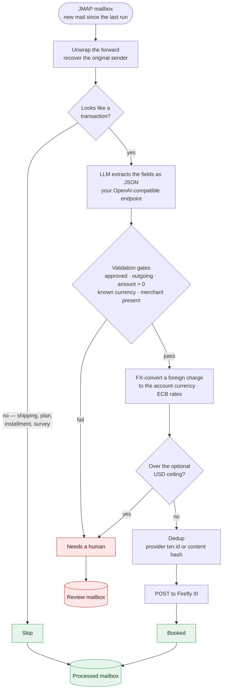

# receipt-ledger

**Turn the transaction-notification emails your bank and PayPal already send into
[Firefly III](https://www.firefly-iii.org/) transactions — automatically.**

receipt-ledger is a small, self-hosted tool for [Firefly III](https://www.firefly-iii.org/)
users who want their real-world spending in the ledger but can't use the usual
importers. Some accounts have no API, aren't on Plaid/SimpleFIN/Nordigen, or are
blocked by PSD2 — but they *do* email you every time the card is charged.
receipt-ledger reads those notification emails, extracts the transaction with a
small (local) language model, and books it into Firefly III with the right
account, currency, and amount.

It runs once and exits. Drop it into a Kubernetes CronJob (or any scheduler) and
your ledger stays current hourly, hands-free.

## Why you might want this

- **No API? No problem.** If your bank or payment provider emails you when you
  spend, receipt-ledger can get it into Firefly — no scraping, no aggregator, no
  open-banking hoops.
- **Private by default.** Extraction runs against *your* OpenAI-compatible LLM
  endpoint (e.g. [Ollama](https://ollama.com/)). Your financial emails never
  leave your infrastructure and nothing is sent to a third-party AI service.
- **It won't quietly get your books wrong.** Every booking passes deterministic,
  unit-tested validation gates; the model only *suggests* fields and cannot book
  anything on its own — that's enforced at the type level (see
  [Is it safe?](#is-it-safe-to-point-at-my-real-ledger)). Foreign charges are
  FX-converted, re-runs are idempotent, and anything ambiguous is moved to a
  `Review` mailbox instead of being mis-booked.
- **Multi-currency, multi-account.** Each charge is routed to the correct Firefly
  asset/liability account; foreign amounts are converted to the account currency
  with the original kept as Firefly's `foreign_amount`.

## Supported sources

| Source | What it handles |
|---|---|
| **PayPal** | Purchase receipts; Pay in 4 / Pay Later / PayPal Credit (→ a liability account); cross-currency receipts (books the exact USD charged); refunds. Shipping updates, plan-created notices, and installment payments are recognized and skipped — they aren't new spending. |
| **Banco Popular Dominicano** | Spanish *"Notificación de Consumo"* card alerts; dual-balance routing (DOP charges → a DOP account, everything else → a foreign/USD account). |

Adding a source is one `Adapter` implementation — a sender match, an extraction
prompt, and a JSON→typed parser. See [`src/adapters/`](src/adapters/).

## How it works



The money-touching steps — validation, FX conversion, dedup, submission — are
deterministic and unit-tested. The LLM only fills in fields; nothing it returns
reaches your ledger without clearing the gates.

## Is it safe to point at my real ledger?

This handles real money, so the design is deliberately conservative:

- **The model cannot book anything.** Only the validation pass can mint the
  `Validated` token that `firefly::submit` requires — so "book an unvalidated
  record" is a *compile error*, not a code-review checklist item.
- **Fail closed.** A declined/refunded/pending status, an unknown currency, a
  missing account, or any extraction error routes the message to `Review` — never
  a guess. Only a clearly-approved, outgoing, plausible charge books.
- **Idempotent.** Firefly's duplicate-hash guard plus a stable dedup key mean a
  re-run (or a re-forwarded email) won't create a second transaction.
- **Auditable.** Every booked email moves to `Processed`; everything else moves to
  `Review` with a human-readable reason. Your inbox is the audit log.

## Quickstart

**You'll need**

1. A **Firefly III** instance and a Personal Access Token.
2. A Firefly **account per funding source** (asset or liability), and its numeric
   account id — e.g. a "PayPal Balance" asset and a "PayPal Credit" liability.
3. A dedicated **mailbox reachable over [JMAP](https://jmap.io/)** (e.g.
   [Stalwart](https://stalw.art/), Fastmail) — call it `ledger@…`.
4. An **OpenAI-compatible LLM endpoint** with a small instruct model (Ollama, or
   any `/v1/chat/completions` server). A 2–4B model is plenty.
5. *(optional)* internet access to a [Frankfurter](https://frankfurter.dev/)
   FX endpoint, for foreign-currency charges.

**Set it up**

1. **Forward your notifications.** Add a filter in your normal mail (e.g. a Gmail
   filter that auto-forwards PayPal/bank notification emails to `ledger@…`).
   Manual `Fwd:` works too.
2. **Create the Firefly accounts** and note their ids (the API returns them, or
   read them from the account URL).
3. **Configure** the environment variables ([below](#configuration)) and run it
   on a schedule. The published image is multi-arch (amd64 + arm64):

   ```
   ghcr.io/kryptt/receipt-ledger:0.7.0
   ```

A minimal one-shot run:

```bash
docker run --rm \
  -e RECEIPT_JMAP_URL=https://mail.example.com \
  -e RECEIPT_JMAP_USER=ledger@example.com \
  -e RECEIPT_JMAP_PASSWORD=… \
  -e RECEIPT_OLLAMA_URL=http://ollama:11434/v1 \
  -e RECEIPT_MODEL_ALLOWLIST=gemma3:4b \
  -e RECEIPT_FIREFLY_URL=https://firefly.example.com \
  -e FIREFLY_III_ACCESS_TOKEN=… \
  -e RECEIPT_PAYPAL_BALANCE_ACCOUNT=12 \
  -v receipt-state:/state \
  ghcr.io/kryptt/receipt-ledger:0.7.0
```

For hands-free operation, wrap that in a Kubernetes `CronJob` (hourly) or a
systemd timer. The job exits `0` on success (including "nothing new"); a non-zero
exit means a real failure you'd want alerted (see [Exit codes](#exit-codes)).

## Configuration

All settings come from the environment; the process reads them once at startup
and a missing required value fails loudly.

| Variable | Default | Notes |
|---|---|---|
| `RECEIPT_JMAP_URL` | `http://stalwart.system.svc.cluster.local:8080` | JMAP base; session discovered at `/.well-known/jmap`. |
| `RECEIPT_JMAP_USER` | `ledger@example.test` | Basic-auth user. |
| `RECEIPT_JMAP_PASSWORD` | — (required) | Basic-auth password. |
| `RECEIPT_STATE_PATH` | `/state/jmap.state` | Persisted `Email/changes` cursor (mount a volume so runs are incremental). |
| `RECEIPT_OLLAMA_URL` | `http://ollama-router.ai:11434/v1` | OpenAI-compatible base. |
| `RECEIPT_MODEL_ALLOWLIST` | `gemma4:e2b` | Comma-separated, priority order. The highest-priority *loaded* model is used (avoids cold-loads); the first is loaded on demand as a fallback. |
| `RECEIPT_LLM_TIMEOUT_SECS` | `600` | Per-request timeout for the extraction call. |
| `RECEIPT_FIREFLY_URL` | `http://firefly:8080` | Firefly III base. |
| `FIREFLY_III_ACCESS_TOKEN` | — (required) | Firefly personal access token. |
| `RECEIPT_FX_URL` | `https://api.frankfurter.dev/v1` | FX-rate provider (Frankfurter-compatible). |
| `RECEIPT_PAYPAL_BALANCE_ACCOUNT` | — (required) | PayPal balance account — **numeric Firefly id**. |
| `RECEIPT_PAYPAL_CREDIT_ACCOUNT` | — (optional) | PayPal Credit account id; absent → credit-funded mail → Review. Also the **destination** of a PayPal Credit payment booked as a transfer. |
| `RECEIPT_PAYING_ACCOUNT_BY_LAST4` | — (optional) | `last4:accountid` pairs (e.g. `0130:1,5678:2`) mapping a payment's funding card/account last-4 to the **source** Firefly account for a PayPal Credit payment transfer. Unknown last-4 (or unset) → Review. Malformed → startup error. |
| `RECEIPT_BANCO_POPULAR_USD_ACCOUNT` | — (optional) | Banco Popular non-DOP account id; absent → non-DOP mail → Review. |
| `RECEIPT_BANCO_POPULAR_DOP_ACCOUNT` | — (optional) | Banco Popular DOP account id; absent → DOP mail → Review. |
| `RECEIPT_MAX_AMOUNT` | — (optional) | Plausibility ceiling, **in US dollars**. A charge whose USD-equivalent (`fx_rate(currency→USD) × amount`) exceeds it routes to Review. Unset → no upper bound. So `100000` means ">$100,000 USD → Review"; a ₩100,000 (≈ $72) charge does **not** trip it. |
| `RECEIPT_PROCESSED_MAILBOX` | `Processed` | Destination for booked / duplicate / skipped mail. |
| `RECEIPT_REVIEW_MAILBOX` | `Review` | Destination for un-bookable mail. |
| `RUST_LOG` | `info` | `tracing` env filter. |

Account variables take a **numeric Firefly account id**; a non-numeric value is a
hard startup error. (For reference, the author's deployment uses ids
`103`/`105`/`106`/`107` for PayPal balance / PayPal credit / Banco USD / Banco
DOP — yours will differ.)

### Exit codes

- `0` — success, including "nothing new to do".
- non-zero — a real failure (config / auth / connection), so a `CronJobFailing`
  alert fires. Per-message parse/validation failures route the offending message
  to `Review` and do **not** fail the job. Mail that isn't a transaction at all
  (shipping updates, plan reminders, surveys, installment payments) is a clean
  skip to `Processed`, not a Review.

## Extraction-accuracy eval

An objective judge for comparing models and prompt changes. It runs the **real**
extraction path (`unwrap_message` → adapter `prompt` → live `/chat/completions`
with the same parameters the pipeline uses → `extract_json` →
`postprocess_with_body` → `validate` + routing) over a labeled dataset and scores
each field (kind / amount / currency / direction / date / merchant / status /
routed account) against ground truth, printing a per-model × per-field accuracy
matrix.

- **Dataset**: [`eval/dataset/`](eval/dataset/) — paired `*.txt` (forwarded email
  body) + `*.json` (ground-truth label). All values are invented/scrubbed. The
  production-derived PayPal edge cases pin the three booking policies the adapter
  enforces: **cross-currency** receipts book the authoritative
  `Total amount of this Transaction: $X USD` figure (not the merchant-currency
  total); **Pay-in-4 installment** payments and plan-created/shipping notices are
  `not_a_transaction` (only a real "You paid $X to <merchant>" purchase books);
  and **funding** routes Pay in 4 / Pay Later / PayPal Credit → credit, any other
  instrument (Balance, Bank Account, linked card) → balance, ignoring
  cashback-card promo lines.
- **Pure scorer**: [`src/eval/`](src/eval/) (`score` + the matrix aggregation) is
  unit-tested under `./test.sh`. Only the live model calls (`src/bin/eval.rs`)
  touch the network, so the crate builds and tests fully offline.

```bash
# If your models are in-cluster, port-forward your LLM endpoint first.
RECEIPT_OLLAMA_URL=http://localhost:11434/v1 cargo run --bin eval

# Specific models + JSON output:
RECEIPT_OLLAMA_URL=http://localhost:11434/v1 \
  cargo run --bin eval -- --models gemma4:e2b,qwen3.6-low --json
```

Models default to `gemma4:e2b,gemma4:e4b,qwen3.6-low,qwen3.6-medium` (override
with `--models a,b,c` or `RECEIPT_EVAL_MODELS`). The `eval` binary is **not** part
of `./test.sh`.

## Build & test

```bash
./test.sh    # docker buildx build --target test (runs cargo test in musl)
./build.sh   # builds + pushes <registry>/receipt-ledger:<Cargo.toml version>
```

Tagged releases (`X.Y.Z`) publish a multi-arch image to
`ghcr.io/kryptt/receipt-ledger`. `build.sh` refuses to push a tag that already
exists — bump `version` in `Cargo.toml` first.

## License

MIT — see [LICENSE](LICENSE).
